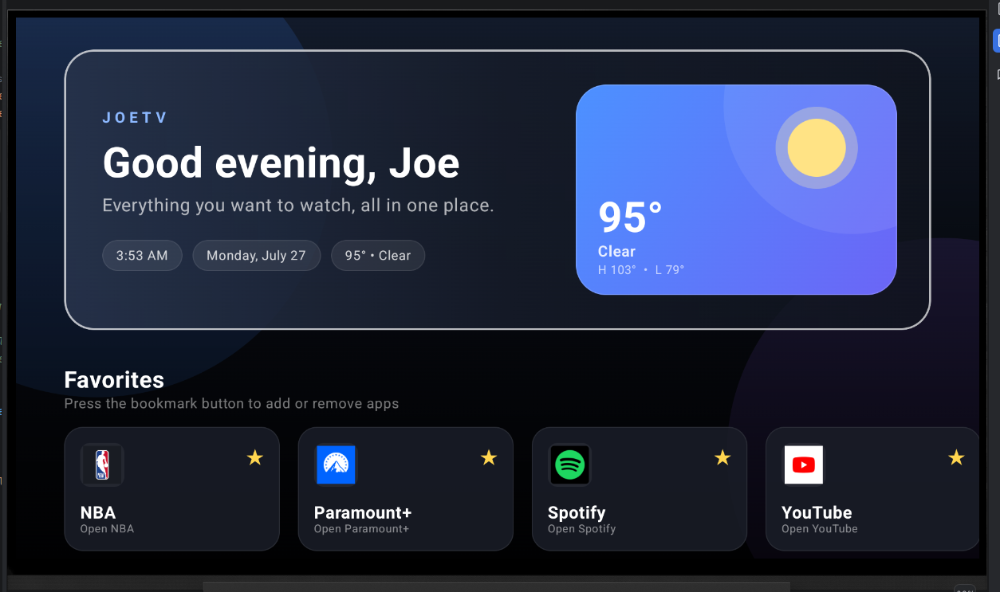

# JoeTV

JoeTV is a custom Android TV launcher I built using Kotlin and Jetpack Compose.

I started this project because I wanted to learn Android development by building something I would actually use instead of following tutorials. My goal was to create a cleaner, faster home screen for Android TV while learning more about UI design, state management, APIs, and Android's application framework.

## Features

- Modern Android TV home screen
- Live weather powered by the Open-Meteo API
- Dynamic greeting with the current time and date
- Favorites and recently opened apps
- Hide and restore applications
- Automatic installed app discovery
- TV remote-friendly navigation
- Animated backgrounds and weather graphics
- Custom UI sound effects

## Built With

- Kotlin
- Jetpack Compose
- Android Studio
- Open-Meteo API
- SharedPreferences
- Android PackageManager

## Why I Built It

As a Management Information Systems student with a Computer Science minor, I wanted to challenge myself by building a complete application from the ground up.

JoeTV gave me hands-on experience with Android development, UI design, state management, REST APIs, and organizing a larger codebase. It has been one of the most rewarding projects I've worked on and continues to evolve as I learn new technologies.

## Screenshots

### Home Screen

  

### Running on an Android Tablet

  

## Future Improvements

Some features I'd like to add in future versions include:

- Voice search
- Continue Watching integration
- Multiple user profiles
- Custom themes
- Performance improvements
- Additional customization options

## Author

**Joe Shannon**

Management Information Systems  
Computer Science Minor  
Kansas State University
